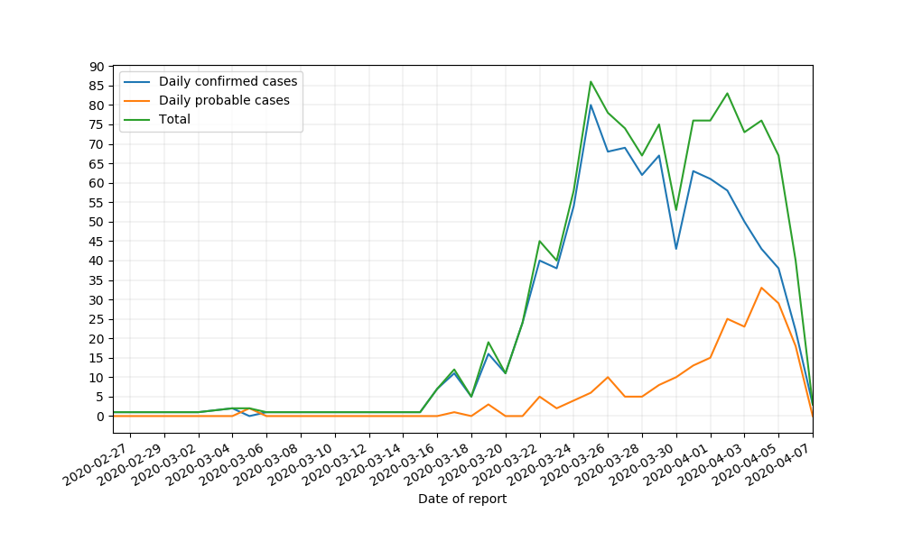
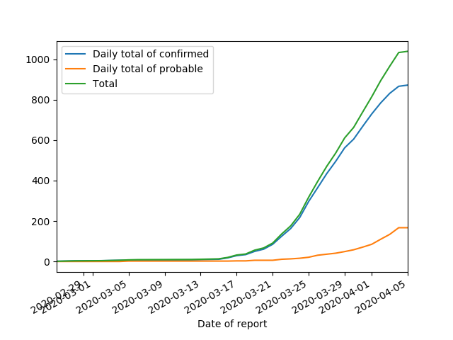
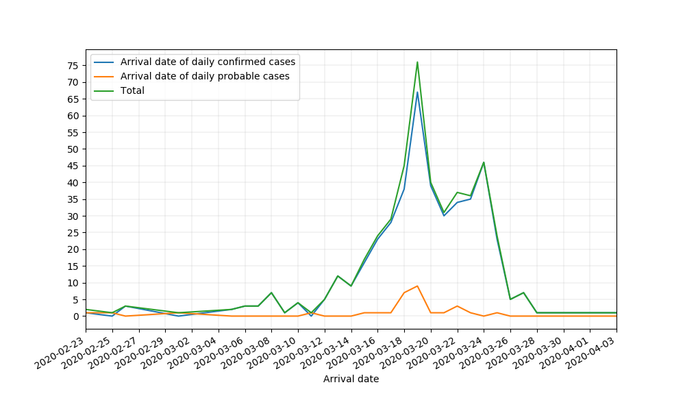

# COVID-19 NZ Data Processing

Script to automatically fetch, process, and plot the NZ covid-19 data from the Ministry of Health's website (https://health.govt.nz).

Getting started:
- 
Dependencies:
- pandas
- requests
- xlrd
- beautifulsoup4
- matplotlib

Simply run:

`pip install git+https://github.com/ABI-Covid-19/moh-data.git`

Example of usage:

```python
from moh_data.main import Basic

run_data = Basic()
run_data.plot_daily_trend()
run_data.plot_cumulative_sum()
run_data.plot_cumulative_arrival_sum()
```

Running the above code in a file should produce the following three figures:





